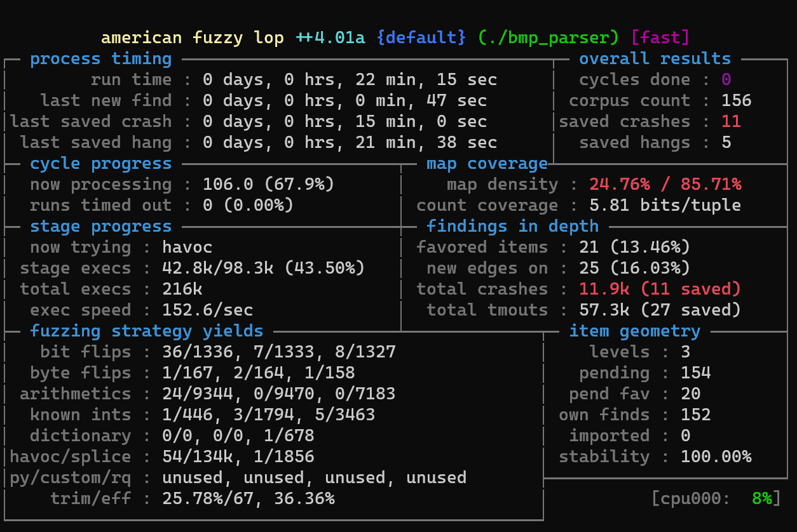

## Fuzzing C Implementation

This file contains basic instructions to run AFL++ on the test projects.

Because fuzz testing is resource intensive, it is recommended not to run
AFL++ in a VM unless you have a fast computer. On Windows, you can run AFL++ in
**WSL2**. If you are running Linux, make sure it is a recent version of Linux (e.g., Ubuntu 21.10 or Fedora 35).

If you have a Mac device, you can install Ubuntu 21.10 in a VM for VirtualBox, VMware Fusion, or Parallels.

If you need to install a new VM, use the [network installer](https://ubuntu.com/download/alternative-downloads), and choose the minimal installation which will install a system without the GUI. This will make your system run faster.

In the following, we will use WSL2 as an example:

1. Follow the instructions from Microsoft to install WSL2.

2. Install Ubuntu on Microsoft Store, and follow the instructions [Here](https://askubuntu.com/questions/1369637/how-do-i-install-ubuntu-21-10-in-wsl-on-windows-11) to upgrade Ubuntu from 20.04 to 21.10.

3. Start Ubuntu and run `sudo apt update` and `sudo apt upgrade` to update your Ubuntu system.

4. Run the following command to install basic build utilities.

    `sudo apt-get install -y build-essential python3-dev automake cmake git flex bison libglib2.0-dev libpixman-1-dev python3-setuptools`

5. Install llvm and clang.

    `sudo apt-get install -y lld llvm llvm-dev clang`

6. Install gcc and its dev-lib

    `sudo apt-get install -y gcc-$(gcc --version|head -n1|sed 's/\..*//'|sed 's/.* //')-plugin-dev libstdc++-$(gcc --version|head -n1|sed 's/\..*//'|sed 's/.* //')-dev`

7. Install tools for QEMU build.

    `sudo apt-get install -y ninja-build # for QEMU mode`

8. Clone the AFL repo:

    `git clone https://github.com/AFLplusplus/AFLplusplus`

9. Build and install AFL++

    ```sh
    cd AFLplusplus
    make distrib
    sudo make install
    ```

10. Check `/usr/local/bin`, it should show something similar to the following:

    ```console
    /usr/local/bin$ ls -lh
    total 7.5M
    -rwxr-xr-x 1 root root 284K Apr  5 18:19 afl-analyze
    lrwxrwxrwx 1 root root    6 Apr  5 18:19 afl-c++ -> afl-cc
    -rwxr-xr-x 1 root root 141K Apr  5 18:19 afl-cc
    lrwxrwxrwx 1 root root    6 Apr  5 18:19 afl-clang -> afl-cc
    lrwxrwxrwx 1 root root    6 Apr  5 18:19 afl-clang++ -> afl-cc
    lrwxrwxrwx 1 root root    6 Apr  5 18:19 afl-clang-fast -> afl-cc
    lrwxrwxrwx 1 root root    9 Apr  5 18:19 afl-clang-fast++ -> ./afl-c++
    lrwxrwxrwx 1 root root    6 Apr  5 18:19 afl-clang-lto -> afl-cc
    lrwxrwxrwx 1 root root    9 Apr  5 18:19 afl-clang-lto++ -> ./afl-c++
    -rwxr-xr-x 1 root root  17K Apr  5 18:19 afl-cmin
    -rwxr-xr-x 1 root root  13K Apr  5 18:19 afl-cmin.bash
    -rwxr-xr-x 1 root root 1.5M Apr  5 18:19 afl-fuzz
    lrwxrwxrwx 1 root root    6 Apr  5 18:19 afl-g++ -> afl-cc
    lrwxrwxrwx 1 root root    7 Apr  5 18:19 afl-g++-fast -> afl-c++
    lrwxrwxrwx 1 root root    6 Apr  5 18:19 afl-gcc -> afl-cc
    lrwxrwxrwx 1 root root    6 Apr  5 18:19 afl-gcc-fast -> afl-cc
    -rwxr-xr-x 1 root root  43K Apr  5 18:19 afl-gotcpu
    -rwxr-xr-x 1 root root  31K Apr  5 18:19 afl-ld-lto
    lrwxrwxrwx 1 root root    6 Apr  5 18:19 afl-lto -> afl-cc
    lrwxrwxrwx 1 root root    6 Apr  5 18:19 afl-lto++ -> afl-cc
    -rwxr-xr-x 1 root root  17K Apr  5 18:19 afl-network-client
    -rwxr-xr-x 1 root root 110K Apr  5 18:19 afl-network-server
    -rwxr-xr-x 1 root root 4.3K Apr  5 18:19 afl-persistent-config
    -rwxr-xr-x 1 root root 7.7K Apr  5 18:19 afl-plot
    -rwxr-xr-x 1 root root 4.8M Apr  5 18:19 afl-qemu-trace
    -rwxr-xr-x 1 root root 320K Apr  5 18:19 afl-showmap
    -rwxr-xr-x 1 root root 5.7K Apr  5 18:19 afl-system-config
    -rwxr-xr-x 1 root root 322K Apr  5 18:19 afl-tmin
    -rwxr-xr-x 1 root root 7.5K Apr  5 18:19 afl-whatsup
    ```

    Particularly, you should see `afl-clang-fast` and `afl-clang-lto`.

11. Get Project4_tests.zip file from your canvas email and put it in your Windows file system and unzip it. Add the test files found in this repo (under the `afl++/bmp` directory) to the uncompressed directory.

    **Do NOT use the test images for project 3!!!**

12. Go to Ubuntu system, copy the uncompressed directory to your home directory. You can access the Windows file system under `/mnt/c` or `/mnt/d` etc.

13. Update the Makefile to the following:

    ```Makefile
    CC=afl-clang-lto
    LD=afl-clang-fast
    CFLAGS=-g -std=c99

    bmp_parser: bmp_parser.o
        $(CC) $(CFLAGS) -o bmp_parser bmp_parser.o -lm

    bmp_parser.o: bmp_parser.c
        $(CC) -c $(CFLAGS) bmp_parser.c

    clean:
        rm -f *.x *.o bmp_parser
    ```

    Note that Makefile use tab for indention, make sure you copied Makefile works.

14. Build the bmp_parser with the `make` command. Enable `ASAN` and `UBSAN` as shown in the AFL++ tutorial. Create a directory to run AFL++ on bmp_parser. Copy bmp_parser to this directory.

    If you enable `ASAN`, you will immediately find an off-by-one bug on line 67. You need to fix it first.

    The clang compiler will also complain a bug in line 125. You can leave it as is or fix it. Just record in your report.

15. Use the following command to run AFL++ on bmp_parser. If everything is correct, you should get some crashes in a couple of minutes.

    `afl-fuzz -i ../bmp -o out -e bmp -D -- ./bmp_parser @@`

Here is a screenshot:



> **Different Fuzzing Strategies**:
>
> AFL provides a lot of options to fuzzing a program. There is usually not an one-strategy-fits-all option. You should experiments with different strategies. For example, there are many environment variables you can set as listed [here](https://aflplus.plus/docs/env_variables/).

> The following strategy was provided by Benjamin Brecher, which was shown to be very effective: enable AFL_USE_ASAN, AFL_LLVM_LAF_ALL, and AFL_USE_UBSAN before compiling the program with afl-clang-fast. You need to fix the memory leak and strcpy off by one buffer overflow first. He was able to find 32 crashes in about 30 minutes.

## Fuzzing Python Implementation

To fuzz Python programs with AFL, you need to install python-afl. Follow the following steps:

1. Install python3-pip with `sudo apt install python3-pip`.

2. Install python-afl

    ```console
    $ pip install python-afl
    $ export PATH="$HOME/.local/bin:$PATH"
    ```

    The second command is necessary because pip install binary in `~/.local/bin`, which isn't in your PATH by default.

3. Update the source code of the Python parser. Use `parse_bmp_1.py` as an example (by Benjamin):

    ```python
    # add this to the file header after all other imports
    import afl

    ...

    # Replace the following code at the bottom of the file
    # if __name__ == '__main__':
    #   main ()
    # with

    while afl.loop(1000):
        try:
            main()
        except AssertionError:
            pass

        sys.stdin.seek(0)
    ```

4. Fuzz your python program with the following command

    ```console
    $ python-afl-fuzz -i <input> -o <output> -m none -t 4000 -D -M fuzzer01 -- ./parse_bmp_1.py @@
    ```

    Replace `<input>` and `<output>` with the directories for test cases and results as you do for fuzzing C programs.

> **A note about parser_bmp_2.py**
>
> For the second implementation in Python, you need to make the following changes:
>
> 1. add this line at the very beginning of the file: `#!/usr/bin/env python3`
> 2. Put everything (except imports) in the main function.
>
>     Add one additional level of indention to each line of the current code, then insert `def main():` as a new line before the existing code, after imports.
